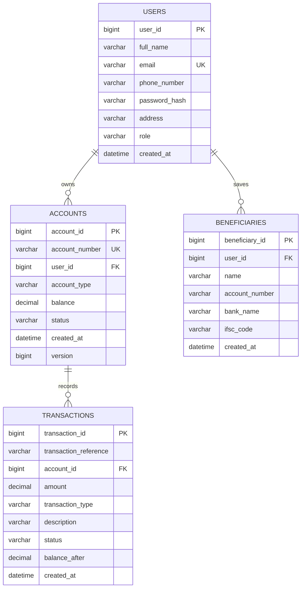

# Entity-Relationship Diagram

This renders automatically when viewed on GitHub (GitHub supports Mermaid
in Markdown). If viewing elsewhere, paste the code block into
https://mermaid.live to render it.

## Design notes

- **users -> accounts** is one-to-many: a customer can hold multiple
  accounts (e.g. one SAVINGS and one CURRENT), but each account belongs to
  exactly one customer.
- **accounts -> transactions** is one-to-many: every deposit, withdrawal,
  and each leg of a transfer is written as its own transaction row scoped
  to a single account, so `SELECT * FROM transactions WHERE account_id = ?`
  always returns that account's complete, self-contained history.
- **users -> beneficiaries** is one-to-many: each customer maintains their
  own private beneficiary list; beneficiaries are not shared across users.
- A **fund transfer** does not get a dedicated table. Instead it produces
  two `TRANSFER`-type transaction rows (debit + credit) that share the same
  `transaction_reference`, which keeps the schema normalized (no duplicate
  transfer-specific columns bolted onto `transactions`) while still letting
  you reconstruct the full transfer by querying on the shared reference.
